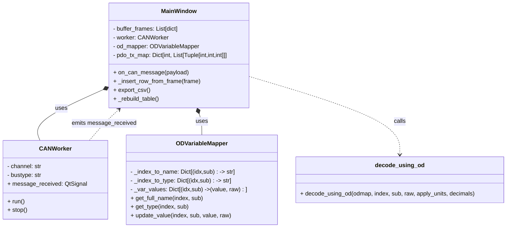
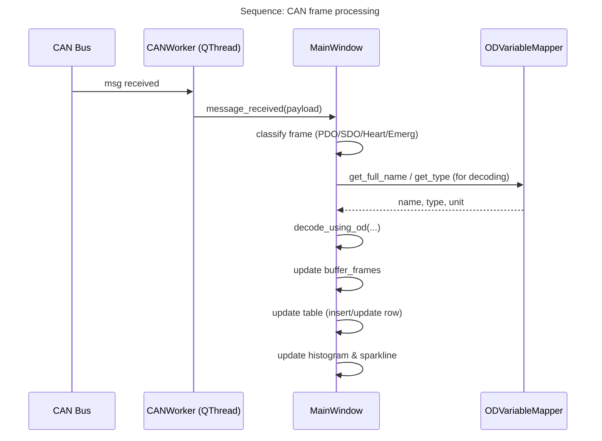
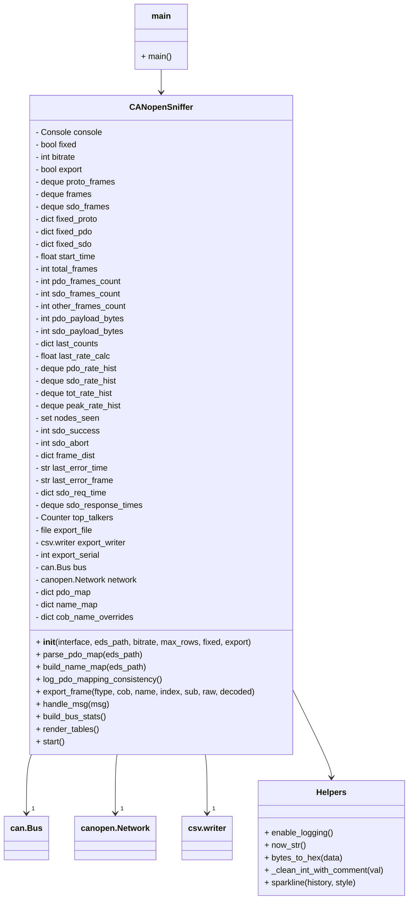
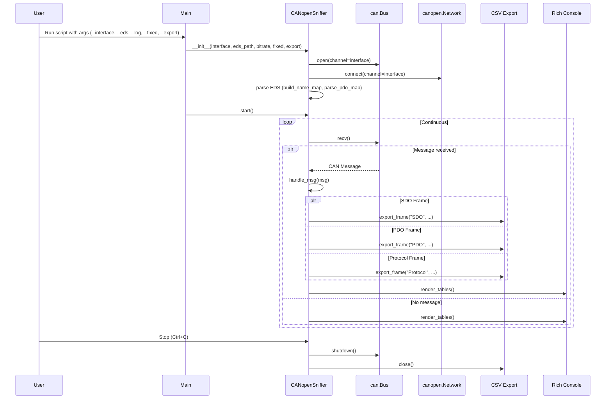
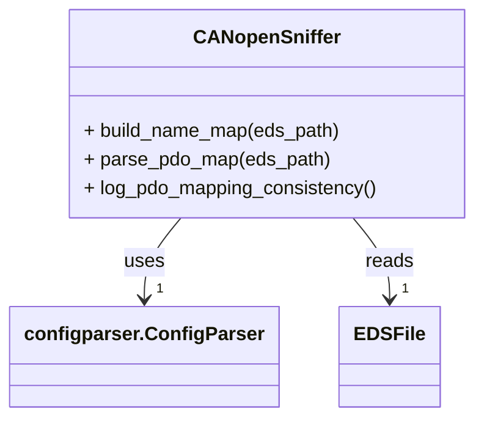
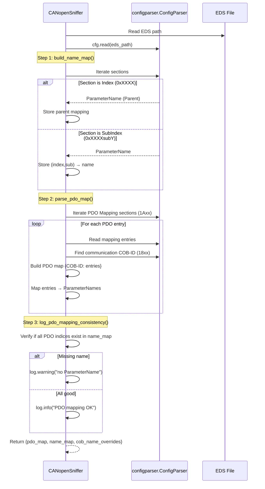

> `iota2` - Making Imaginations, Real
>
> <i2.iotasquare@gmail.com>


```
 ██╗ ██████╗ ████████╗ █████╗ ██████╗
 ██║██╔═══██╗╚══██╔══╝██╔══██╗╚════██╗
 ██║██║   ██║   ██║   ███████║ █████╔╝
 ██║██║   ██║   ██║   ██╔══██║██╔═══╝
 ██║╚██████╔╝   ██║   ██║  ██║███████╗
 ╚═╝ ╚═════╝    ╚═╝   ╚═╝  ╚═╝╚══════╝
```

# CANopen Sniffer

**A CANopen bus sniffer with a PyQt GUI or CLI option.**
It decodes PDOs and SDOs using an EDS/OD file, shows a scrolling searchable table, supports fixed/sequential display modes, unit scaling, histogram & frame-rate graphs, CSV export, a simulator (`vcan`), and pytest unit tests.

---

## Table of Contents

- [CANopen Sniffer](#canopen-sniffer)
  - [Table of Contents](#table-of-contents)
  - [Features](#features)
    - [GUI Sniffer](#gui-sniffer)
    - [CLI Sniffer](#cli-sniffer)
  - [Repository Layout](#repository-layout)
  - [Dependencies](#dependencies)
  - [Setting Up SocketCAN](#setting-up-socketcan)
    - [Virtual CAN (for development)](#virtual-can-for-development)
    - [Physical CAN adapter](#physical-can-adapter)
  - [Running the GUI Sniffer](#running-the-gui-sniffer)
  - [Running the CLI Sniffer](#running-the-cli-sniffer)
  - [Typical Workflow](#typical-workflow)
  - [Running Unit Tests](#running-unit-tests)
  - [GUI Features](#gui-features)
    - [Exporting Data / CSVs](#exporting-data--csvs)
    - [Filtering, Modes \& Behavior](#filtering-modes--behavior)
    - [Code Structure (classes/functions)](#code-structure-classesfunctions)
    - [Class Diagram](#class-diagram)
    - [Sequence Diagram (Frame → Decode → Display)](#sequence-diagram-frame--decode--display)
  - [CLI Features](#cli-features)
    - [Code Structure (classes/functions)](#code-structure-classesfunctions-1)
    - [Class Diagram](#class-diagram-1)
    - [Sequence Diagram](#sequence-diagram)
  - [EDS Parsing](#eds-parsing)
    - [Class Diagram](#class-diagram-2)
    - [Workflow Sequence Diagram](#workflow-sequence-diagram)
  - [Troubleshooting \& Tips](#troubleshooting--tips)
  - [Planned Improvements](#planned-improvements)

---

## Features

### GUI Sniffer
- PyQt5 GUI with a scrolling, searchable table of incoming CAN frames
- EDS/OD-aware decoding:
    - Uses `canopen.LocalNode` metadata when available
    - Robust INI-style EDS parsing fallback
    - Hierarchical names like `Parent.Child` (e.g. `ImpedanceMeasurement.channel1`)
    - OD-declared Data Type, Index, Subindex, Unit & scaling applied (toggleable)
- Fixed vs Sequential display mode:
    - **Fixed**: newest frame for a COB-ID replaces older row with same COB-ID
    - **Sequential**: append frames continuously
- SDO frames included in traces and decoded (expedited/size-aware)
- Reversible filtering (filter applies to buffer and updates matched rows live)
- Pause, Clear, Filter and Clear Filter controls
- Export → Export Data to CSV (All or Filtered) and Export → Export Histogram CSV
- Histogram (COB-ID counts) and live frame-rate sparkline (visual)
- Deterministic per-COB color coding in histogram
- Decoded Data column limited to 40 characters (tooltip/details hold full value)
- Row color coding by Type (PDO, SDO, Heartbeat/Emergency/Time)
- Copy selected rows or copy as CSV via context menu; double-click row shows full details
- Persisted user preferences across restarts (QSettings)
- Unit tests (pytest) and simulator script to push frames to `vcan0`
- Safe fallbacks and heuristics for partial OD decoding

### CLI Sniffer
- Parses PDO mappings and ParameterNames from EDS.
- Displays PDO and SDO traffic with human-readable names.
- Uses rich tables for live updates.
- Optional `--log` for logging to file.
- Optional `--fixed` mode: instead of scrolling history, updates existing rows and tracks repeat count.
- Optional `--export` to create CSV file containing received CAN frames.
- Bus Stats table next to Protocol Data with many metrics (rolling peak, sparklines, etc).

---

## Repository Layout

```bash
.
├─ canopen_bus_sniffer_gui.py       # main GUI script (or chosen file name)
├─ canopen_bus_sniffer_cli.py       # main GUI script (or chosen file name)
├─ tests/
│  └─ test_sniffer.py               # pytest unit tests
└─ README.md                        # this file
```

---

## Dependencies

```bash
pip install python-can canopen PyQt5 pytest rich
```

---

## Setting Up SocketCAN

### Virtual CAN (for development)
```bash
sudo modprobe vcan
sudo ip link add dev vcan0 type vcan
sudo ip link set dev vcan0 up
ip -details link show vcan0
```

### Physical CAN adapter
```bash
sudo ip link set can0 type can bitrate 1000000
sudo ip link set can0 up
```

---

## Running the GUI Sniffer

```bash
python canopen_bus_sniffer_gui.py --interface vcan0 --eds sample_device.eds
```

**Options:**
- `--eds PATH` → path to EDS file
- `--interface NAME` → socketcan interface (default `can0`)

---

## Running the CLI Sniffer

```bash
python canopen_bus_sniffer_cli.py --interface vcan0 --eds sample_device.eds --bitrate 1000000 --fixed --log --export
```

**Options:**
- `--interface NAME` (default `can0`)
- `--eds PATH` (optional)
- `--bitrate 1000000` (default 1 Mbps)
- `--fixed` (row update mode)
- `--log` (enable logging)
- `--export` (CSV export)

---

## Typical Workflow

1. Start `vcan0` (or real CAN interface)
2. Run GUI or CLI sniffer
3. Optionally run `canopen_frame_simulator.py`

---

## Running Unit Tests

```bash
pytest -q
```

**Notes:**
- One test requires `vcan0` (skipped if missing)
- Tests cover OD parsing, `decode_using_od()`, and PDO parsing

---

## GUI Features

### Exporting Data / CSVs
- **Export → Export Data to CSV**: prompts Save all logs? with `Yes = all buffer`, `No = only filtered/visible rows`. Exports full decoded values (not truncated).
- **Export → Export Histogram**: writes `COB-ID, Count, ColorHEX`.
- The context menu also supports copying selected rows and copying selected rows as CSV to clipboard.

### Filtering, Modes & Behavior
- **Filter field:** comma-separated COB-IDs or free substrings. Filtering is reversible — it rebuilds table from buffer showing only matching rows and keeps those rows live-updated.
- **Mode:**
    - **Fixed** — newest frame for a COB-ID replaces the existing row for that COB-ID.
    - **Sequential** — frames append continuously.
- **Pause**: temporarily stop updating table with incoming frames.
- **Clear**: remove the displayed table and internal buffer.

### Code Structure (classes/functions)
- `ODVariableMapper`
    - Reads EDS (via `canopen.LocalNode` if possible) and/or directly parses EDS INI sections.
    - Maintains mappings:
        - `(index, sub) -> ParameterName`
        - `(index, sub) -> DataType`
        - `(index, sub) -> Unit/Factor`
    - get_full_name(index, sub) builds hierarchical name with heuristics to avoid placeholder labels (e.g. Highest sub-index supported).
    - `update_value(index, sub, value, raw)` stores last seen values and optionally logs OD changes to CSV.
- `CANWorker` (QThread)
    - Runs `python-can` `Bus.recv()` loop and emits `message_received` Qt signals with message payloads.
- `MainWindow` (QMainWindow)
    - Receives frames and classifies them (Special frames, SDO, PDO).
    - For PDOs: uses parsed TPDO mapping from EDS to split payload per mapped variables and decode each via `decode_using_od`.
    - Maintains a bounded `buffer_frames` (for reversible filtering and CSV export).
    - Manages table insert/update, color coding, auto column sizing (with buffer padding) and fixed decoded column width (40 chars).
    - Updates histogram & sparkline widgets.
- `decode_using_od(odmap, index, sub, raw, apply_units, decimals)`
    - Decodes raw bytes into strings according to declared OD datatype (Boolean, uint8/16/32, int8/16/32, real32, real64, visible string, domain) and applies unit/factor formatting when requested.

### Class Diagram


### Sequence Diagram (Frame → Decode → Display)


---

## CLI Features

### Code Structure (classes/functions)
- `enable_logging()`
  - Configures file logging (`canopen_bus_sniffer_cli.log`).

- Helpers:
  - `now_str()` → formatted timestamp.
  - `bytes_to_hex()` → converts CAN payload to hex string.
  - `_clean_int_with_comment()` → parses EDS integers ignoring comments.
  - `sparkline(history, style)` → renders mini sparklines for stats.

- `CANopenSniffer` (main class)
  - **__init__**: sets up CAN bus, CANopen network, CSV export, stats, frame buffers.
  - `build_name_map(eds_path)` → builds `(index,sub) → ParameterName` from EDS.
  - `parse_pdo_map(eds_path)` → parses PDO mapping (`1Axx/18xx`) from EDS.
  - `log_pdo_mapping_consistency()` → warns if mapped OD entries lack names.
  - `export_frame(ftype, cob, name, index, sub, raw, decoded)` → logs frame to CSV.
  - `handle_msg(msg)` → core logic:
    - Classifies frame as **Protocol / PDO / SDO**.
    - Updates stats (frame counts, top talkers, errors, latency).
    - Decodes PDO/SDO payloads (using EDS maps).
    - Exports to CSV if enabled.
  - `build_bus_stats()` → constructs **Bus Stats** table (frame rates, bus util, SDO stats, etc).
  - `render_tables()` → renders 4 Rich tables: Protocol, Bus Stats, PDO, SDO.
  - `start()` → main loop: receive frames via `python-can`, update stats + UI.

- `main()`
  - Parses CLI args (`--interface`, `--eds`, `--bitrate`, `--log`, `--fixed`, `--export`).
  - Initializes `CANopenSniffer` and runs `.start()`.

### Class Diagram


### Sequence Diagram


---

## EDS Parsing

### Class Diagram


### Workflow Sequence Diagram


---

## Troubleshooting & Tips

- If a name shows `<Unknown>`:
    - Confirm the EDS path passed is correct and the EDS contains `ParameterName` sections for the relevant indexes/subindexes.
    - Try loading the EDS manually: in Python `canopen.LocalNode(node_id, "your.eds")` to check canopen can read it.
- If decoding looks wrong:
    - Check `DataType` values in the EDS (use `0x0008` for REAL32 etc.)
    - Check whether signed/unsigned is declared — script uses OD-declared type when available.
- If `vcan0` frames do not appear:
    - Ensure `vcan0` exists and is `UP` (`ip link show vcan0`).
    - Start the sniffer with `--channel vcan0`.
- If the GUI is slow:
    - Reduce `buffer_max` in code or switch to Fixed mode to limit table rows.
- If you want persistent color mapping across machines:
    - Add a mapping persisted to QSettings keyed by COB-ID.

---

## Planned Improvements

- Add per-COB color legend widget
- Export/Import recorded data in JSON/PCAP-like binary
- Add "follow" mode (click entry to filter/track that Node/Index)
- Add remote-control SDO/ PDO send UI
- CI (GitHub Actions) with pytest and optional simulated CAN backend

---